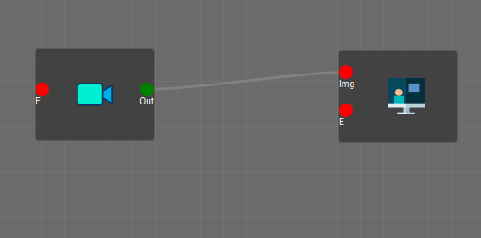

En la primera semana he empezado a hacer pequeñas pruebas con la plataforma de [Visual Circuit](https://jderobot.github.io/VisualCircuit/). Para ello he tenido que instalar [ROS Noetic](http://wiki.ros.org/noetic).

**ROS Noetic**. Robot Operating System (ROS) es un middleware robótico, es decir, una colección de frameworks para el desarrollo de software de robots. 

**Visual Circuit**. Visual Circuit es una plataforma web con un editor visual basado en bloques programables para el desarrollo de aplicaciones software robóticas, construido sobre [IceStudio](https://github.com/FPGAwars/icestudio).

Para empezar a entender la plataforma, he programado circuitos simples, como uno en el que se recibe una imagen de una cámara y se muestra en una pantalla.

